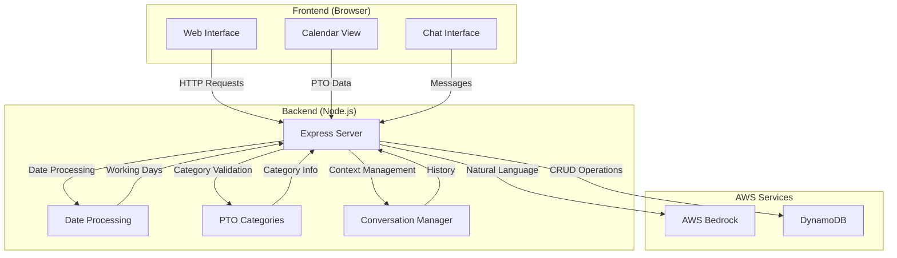

# AI PTO Manager

An intelligent PTO (Paid Time Off) management system powered by AWS Bedrock's Claude 3 Sonnet model, featuring natural language processing and a ChatGPT-like interface.


The AI PTO Manager provides an intuitive chat interface for managing PTO requests, with features like natural language processing, smart date handling, and a visual calendar. Built with AWS Bedrock and DynamoDB, it offers a seamless experience for scheduling and managing time off.

## Features
- Natural language PTO scheduling and queries
- Smart date parsing with weekend/holiday awareness
- PTO categories (Vacation, Sick Leave, etc.)
- Interactive calendar view with color-coding
- Contextual conversation support
- AWS Bedrock integration for AI processing
- DynamoDB for persistent storage
- Real-time UI updates

## Technical Stack
- **Frontend**: HTML, CSS, JavaScript (vanilla)
- **Backend**: Node.js with Express
- **AI**: AWS Bedrock with Claude 3 Sonnet (us.anthropic.claude-3-7-sonnet-20250219-v1:0)
- **Storage**: AWS DynamoDB
- **Authentication**: AWS IAM using my-app-profile profile

## Requirements
- Node.js (v21.7.3 or higher)
- AWS Account with access to:
  - AWS Bedrock
  - DynamoDB
- AWS credentials configured with `my-app-profile` profile

## Dependencies
```json
{
  "dependencies": {
    "@aws-sdk/client-bedrock-runtime": "^3.758.0",
    "@aws-sdk/client-dynamodb": "^3.767.0",
    "@aws-sdk/credential-provider-ini": "^3.758.0",
    "body-parser": "^1.20.2",
    "dotenv": "^16.3.1",
    "express": "^4.18.2"
  }
}
```

## Project Structure
- `server.js` - Main application server with AWS integration
- `public/index.html` - Frontend UI with chat and calendar interface
- **Utils**:
  - `dateUtils.js` - Date parsing and validation
  - `holidayUtils.js` - Holiday calendar management
  - `ptoCategories.js` - PTO type definitions

## AWS Integration

### AWS Bedrock
- **Model**: Claude 3 Sonnet (us.anthropic.claude-3-7-sonnet-20250219-v1:0)
- **Features**:
  - Natural language processing
  - Contextual conversation
  - PTO request parsing
  - Smart date understanding

### DynamoDB
- **Table**: `PTORecords`
  - Primary Key: `id` (String)
  - Attributes:
    - `startDate` (String, YYYY-MM-DD)
    - `endDate` (String, YYYY-MM-DD)
    - `type` (String)
    - `numberOfDays` (Number)
    - `status` (String)
- **Features**:
  - Auto table initialization
  - Type conversion
  - Retry logic
  - Error handling
  - Detailed logging

### AWS Configuration
```json
{
    "Version": "2012-10-17",
    "Statement": [
        {
            "Effect": "Allow",
            "Action": [
                "bedrock:InvokeModel"
            ],
            "Resource": "arn:aws:bedrock:*:*:model/anthropic.claude-*"
        },
        {
            "Effect": "Allow",
            "Action": [
                "dynamodb:CreateTable",
                "dynamodb:PutItem",
                "dynamodb:GetItem",
                "dynamodb:UpdateItem",
                "dynamodb:DeleteItem",
                "dynamodb:Scan",
                "dynamodb:Query"
            ],
            "Resource": "arn:aws:dynamodb:*:*:table/PTORecords"
        }
    ]
}
```

## Storage Configuration

The application supports two storage backends:
1. DynamoDB (default)
2. External API

To configure the storage backend, modify `config/storage.js`:

```javascript
module.exports = {
    storage: {
        // Set to true to use external API, false for DynamoDB
        useExternalApi: false,
        
        // External API configuration
        api: {
            baseUrl: process.env.EXTERNAL_API_URL || 'https://api.example.com/pto',
            endpoints: {
                create: '/records',
                read: '/records/:id',
                update: '/records/:id',
                delete: '/records/:id',
                list: '/records'
            }
        },

        // DynamoDB configuration
        dynamodb: {
            tableName: process.env.DYNAMODB_TABLE_NAME || 'PTORecords',
            region: process.env.AWS_REGION || 'us-east-1'
        }
    }
};
```

### Environment Variables

When using the external API, set these additional environment variables:
- `EXTERNAL_API_URL`: Base URL for the external PTO API
- `EXTERNAL_API_KEY`: Authentication key for the external API

## Setup
1. Install dependencies:
```bash
npm install
```

2. Configure environment:
- Copy `.env.example` to `.env`
- Update configuration:
  ```env
  AWS_REGION=us-east-1
  AWS_PROFILE=my-app-profile
  BEDROCK_MODEL_ID=us.anthropic.claude-3-7-sonnet-20250219-v1:0
  DYNAMODB_TABLE_NAME=PTORecords
  PORT=3000
  ```
- Ensure AWS credentials are configured with `my-app-profile` profile

3. Start the server:
```bash
npm start
# or
node server.js
```

## Utility Scripts
- **Restart Server**: `./restart.sh`
- **AWS Login**: `./aws_login.sh`

## Usage Examples
1. Schedule PTO:
```
"I need next Monday and Tuesday off for vacation"
"Schedule sick leave for tomorrow"
"I'll be out of office from April 1st through 5th"
```

2. Query PTO:
```
"How many vacation days have I taken this year?"
"Show me my upcoming PTO"
"What's my schedule for next month?"
```

3. Update PTO:
```
"Extend my vacation next week by 2 days"
"Change my sick leave tomorrow to vacation"
"Cancel my PTO for next Friday"
```

## Architecture


## Security Notes
- Never commit `.env` file
- Use AWS IAM roles and policies
- HTTPS recommended for production
- No sensitive data stored in frontend

## Contributing
1. Fork the repository
2. Create a feature branch
3. Commit your changes
4. Push to the branch
5. Create a Pull Request
