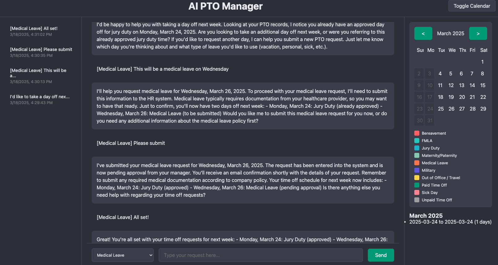
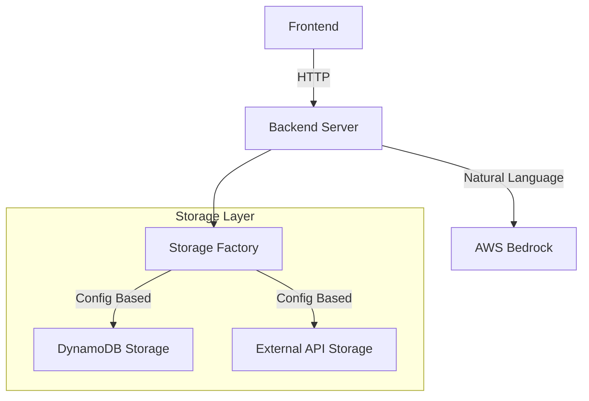
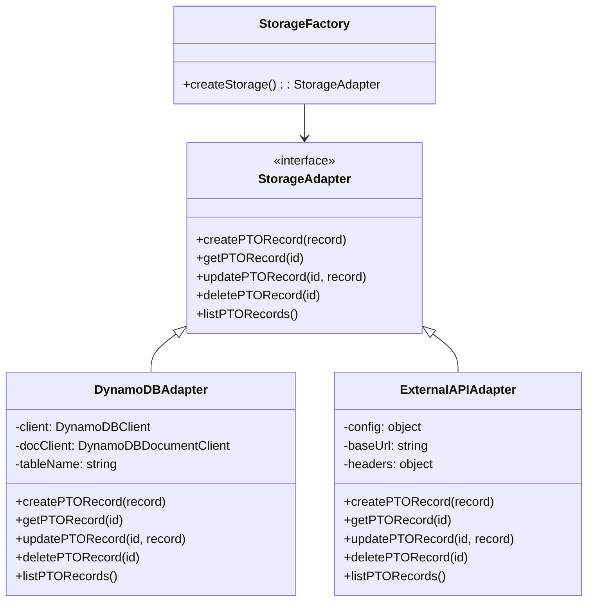

# AI PTO Manager

An intelligent PTO (Paid Time Off) management system powered by AWS Bedrock's Claude 3 Sonnet model, featuring natural language processing and a ChatGPT-like interface.



The AI PTO Manager provides an intuitive chat interface for managing PTO requests, with features like natural language processing, smart date handling, and a visual calendar. Built with AWS Bedrock and DynamoDB, it offers a seamless experience for scheduling and managing time off.

## Features
- Natural language PTO scheduling and queries
- Smart date parsing with weekend/holiday awareness
- PTO categories (Vacation, Sick Leave, etc.)
- Interactive calendar view with color-coding
- Contextual conversation support
- AWS Bedrock integration for AI processing
- DynamoDB for persistent storage
- Real-time UI updates

## PTO Management

### Categories

The application supports various PTO categories, each with its own color coding in the UI:

```javascript
const PTO_CATEGORIES = {
    vacation: "Vacation Days",
    sick: "Sick Leave",
    personal: "Personal Days",
    bereavement: "Bereavement Leave",
    jury: "Jury Duty",
    parental: "Parental Leave"
};
```

### Calendar Integration

The application includes a built-in calendar system that:
- Displays PTO days with category-specific colors
- Marks holidays and weekends
- Calculates working days (excluding holidays and weekends)
- Supports date ranges and relative dates (e.g., "next week", "this Friday")

#### 2025 Holiday Calendar

The application includes a predefined holiday calendar for 2025. Holidays are automatically considered when calculating working days for PTO requests.

Access the holiday calendar via:
```
GET /api/pto/holidays
```

### Natural Language Processing

The application uses AWS Bedrock (Claude v3 Sonnet) to understand natural language PTO requests such as:
- "I need vacation days for next week"
- "Schedule sick leave for tomorrow"
- "Take personal time off from March 20 to March 22"
- "Cancel my PTO for next Friday"

The AI model:
1. Extracts dates from relative references
2. Identifies PTO categories
3. Calculates working days
4. Considers holidays and weekends
5. Maintains conversation context

### Conversation Management

The application maintains conversation history to provide context-aware responses:

1. **Session Management**
   - Each user interaction is tracked by session ID
   - Maintains recent conversation history
   - Provides context for follow-up requests

2. **Context Handling**
   - Tracks recent PTO requests and updates
   - Maintains reference to current date (2025-03-19)
   - Preserves category selections
   - Remembers date ranges discussed

Example conversation flow:
```
User: "I need vacation days for next week"
AI: "I'll help you schedule vacation days. How many days would you like to take?"

User: "Monday through Wednesday"
AI: "Based on our conversation, I'll schedule vacation days for March 24-26, 2025 
    (3 working days). Would you like me to confirm this PTO request?"
```

3. **Date Processing**
   - Handles relative date references
   - Considers working days only
   - Accounts for holidays and weekends
   - Validates date ranges

4. **PTO Categories**
   - Maintains selected category context
   - Validates category changes
   - Preserves category preferences

## Technical Stack
- **Frontend**: HTML, CSS, JavaScript (vanilla)
- **Backend**: Node.js with Express
- **AI**: AWS Bedrock (Claude v3 Sonnet)
- **Storage**: AWS DynamoDB (default) or External API
- **Authentication**: AWS IAM using my-app-profile

## Requirements
- Node.js (v21.7.3 or higher)
- AWS Account with access to:
  - AWS Bedrock
  - DynamoDB
- AWS credentials configured with `my-app-profile` profile

## Dependencies
```json
{
  "dependencies": {
    "@aws-sdk/client-bedrock-runtime": "^3.758.0",
    "@aws-sdk/client-dynamodb": "^3.767.0",
    "@aws-sdk/credential-provider-ini": "^3.758.0",
    "body-parser": "^1.20.2",
    "dotenv": "^16.3.1",
    "express": "^4.18.2"
  }
}
```

## Project Structure
- `server.js` - Main application server with AWS integration
- `public/index.html` - Frontend UI with chat and calendar interface
- **Utils**:
  - `dateUtils.js` - Date parsing and validation
  - `holidayUtils.js` - Holiday calendar management
  - `ptoCategories.js` - PTO type definitions

## AWS Integration

### AWS Bedrock
- **Model**: Claude 3 Sonnet (us.anthropic.claude-3-7-sonnet-20250219-v1:0)
- **Features**:
  - Natural language processing
  - Contextual conversation
  - PTO request parsing
  - Smart date understanding

### DynamoDB
- **Table**: `PTORecords`
  - Primary Key: `id` (String)
  - Attributes:
    - `startDate` (String, YYYY-MM-DD)
    - `endDate` (String, YYYY-MM-DD)
    - `type` (String)
    - `numberOfDays` (Number)
    - `status` (String)
- **Features**:
  - Auto table initialization
  - Type conversion
  - Retry logic
  - Error handling
  - Detailed logging

### DynamoDB Schema

When using DynamoDB storage, the following table structure is used:

**Table Name:** `PTORecords` (configurable via `DYNAMODB_TABLE_NAME`)

**Schema:**
- Primary Key: `id` (String)
- Attributes:
  - `startDate` (String): Start date of PTO
  - `endDate` (String): End date of PTO
  - `type` (String): PTO category
  - `numberOfDays` (Number): Number of working days
  - `status` (String): PTO status (e.g., 'approved')

The table is automatically created if it doesn't exist when the application starts.

**Example Record:**
```json
{
    "id": "1647889012345",
    "startDate": "2025-03-20",
    "endDate": "2025-03-21",
    "type": "vacation",
    "numberOfDays": 2,
    "status": "approved"
}
```

### AWS Configuration

### Required Settings

1. **AWS Bedrock Model ID**
   ```
   BEDROCK_MODEL_ID=us.anthropic.claude-3-7-sonnet-20250219-v1:0
   ```
   This specific model ID is required and must not be changed.

2. **AWS Profile**
   ```
   AWS_PROFILE=my-app-profile
   ```
   The application must use the `my-app-profile` AWS credentials profile.

3. **AWS Region**
   ```
   AWS_REGION=us-east-1
   ```
   Default region for AWS services (Bedrock and DynamoDB).

### AWS IAM Policy

The following IAM policy should be attached to the `my-app-profile` credentials:

```json
{
    "Version": "2012-10-17",
    "Statement": [
        {
            "Effect": "Allow",
            "Action": [
                "bedrock:InvokeModel"
            ],
            "Resource": "arn:aws:bedrock:*:*:model/anthropic.claude-3-7-sonnet-20250219-v1:0"
        },
        {
            "Effect": "Allow",
            "Action": [
                "dynamodb:CreateTable",
                "dynamodb:PutItem",
                "dynamodb:GetItem",
                "dynamodb:UpdateItem",
                "dynamodb:DeleteItem",
                "dynamodb:Scan",
                "dynamodb:Query"
            ],
            "Resource": "arn:aws:dynamodb:*:*:table/PTORecords"
        }
    ]
}
```

Note: The Bedrock model ARN specifically allows only the required Claude v3 Sonnet model.

### AWS Services

1. **AWS Bedrock**
   - Natural language processing for PTO requests
   - Uses Claude v3 Sonnet model (specific version required)
   - Handles request interpretation and response generation

2. **AWS DynamoDB** (when using default storage)
   - Stores PTO records with automatic table creation
   - Uses IAM authentication via my-app-profile
   - Includes retry logic and error handling
   - Auto-converts attribute types

## Architecture

The AI PTO Manager uses a modular architecture with the following components:



### Storage Adapter Pattern

The application implements a flexible storage adapter pattern that allows switching between different storage backends:



### Components

1. **Frontend**: Static HTML/CSS/JS interface with a ChatGPT-like design
2. **Backend Server**: Node.js/Express server handling API requests
3. **AWS Bedrock**: AI service using Claude v3 Sonnet for natural language processing
4. **Storage Layer**: 
   - Storage Factory: Creates appropriate storage adapter based on configuration
   - DynamoDB Adapter: AWS DynamoDB implementation (default)
   - External API Adapter: REST API implementation for third-party storage

## Storage Configuration

The application uses a flexible storage adapter pattern that allows seamless switching between different storage backends without modifying the application code.

### Available Storage Backends

1. **DynamoDB (Default)**
   - AWS DynamoDB for persistent storage
   - Auto-creates tables if they don't exist
   - Uses AWS IAM for authentication
   - Configured via AWS credentials profile

2. **External API**
   - REST API implementation for third-party storage
   - Supports standard CRUD operations
   - Uses Bearer token authentication
   - Configurable endpoints and headers

### Configuration

To configure the storage backend, modify `config/storage.js`:

```javascript
module.exports = {
    storage: {
        // Set to true to use external API, false for DynamoDB
        useExternalApi: false,
        
        // External API configuration
        api: {
            baseUrl: process.env.EXTERNAL_API_URL || 'https://api.example.com/pto',
            endpoints: {
                create: '/records',
                read: '/records/:id',
                update: '/records/:id',
                delete: '/records/:id',
                list: '/records'
            },
            headers: {
                'Authorization': `Bearer ${process.env.EXTERNAL_API_KEY || ''}`,
                'Content-Type': 'application/json'
            }
        },

        // DynamoDB configuration
        dynamodb: {
            tableName: process.env.DYNAMODB_TABLE_NAME || 'PTORecords',
            region: process.env.AWS_REGION || 'us-east-1'
        }
    }
};
```

### Environment Variables

#### Required Settings

1. **AWS Bedrock Model ID**
   ```
   BEDROCK_MODEL_ID=us.anthropic.claude-3-7-sonnet-20250219-v1:0
   ```
   This specific model ID is required and must not be changed.

2. **AWS Profile**
   ```
   AWS_PROFILE=my-app-profile
   ```
   The application must use the `my-app-profile` AWS credentials profile.

3. **AWS Region**
   ```
   AWS_REGION=us-east-1
   ```
   Default region for AWS services (Bedrock and DynamoDB).

#### DynamoDB Configuration (Default)
- `DYNAMODB_TABLE_NAME`: DynamoDB table name (default: PTORecords)

#### External API Configuration
- `EXTERNAL_API_URL`: Base URL for the external PTO API
- `EXTERNAL_API_KEY`: Authentication key for the external API

#### Common Variables
- `PORT`: Server port (default: 3000)

### Storage Implementation

The storage layer is implemented using the adapter pattern with the following components:

1. **StorageAdapter** (Interface)
   - Defines common CRUD operations for PTO records
   - Ensures consistent interface across storage implementations

2. **DynamoDBAdapter**
   - Implements AWS DynamoDB storage
   - Handles table creation and management
   - Uses AWS SDK v3 for better performance

3. **ExternalAPIAdapter**
   - Implements REST API storage
   - Handles HTTP requests and responses
   - Supports custom endpoints and authentication

4. **StorageFactory**
   - Creates appropriate storage adapter based on configuration
   - Provides single point of access for storage operations

## Error Handling

The application includes robust error handling for storage operations:

#### DynamoDB Storage
1. **Table Management**
   - Auto-creates table if not found during operations
   - Waits for table to be active before retrying operations
   - Handles `ResourceNotFoundException` gracefully

2. **Data Operations**
   - Proper type conversion for DynamoDB attributes
   - Retry logic for operations after table creation
   - Graceful handling of empty results
   - Validates data before storage operations

3. **Logging**
   - Detailed error logging for debugging
   - Operation status tracking
   - Table creation events
   - Retry attempts

#### External API Storage
1. **Request Handling**
   - Validates API responses
   - Handles HTTP status codes appropriately
   - Manages authentication errors
   - Tracks API rate limits

2. **Error Recovery**
   - Retries failed requests with backoff
   - Handles network timeouts
   - Validates response formats
   - Reports detailed error messages

Example error handling flow:
```javascript
try {
    // Attempt operation
    const result = await storage.createPTORecord(record);
} catch (error) {
    if (error.name === 'ResourceNotFoundException') {
        // Auto-create table
        await storage.createTable();
        // Retry the operation
        const result = await storage.createPTORecord(record);
    }
}
```

## Setup
1. Install dependencies:
```bash
npm install
```

2. Configure environment:
- Copy `.env.example` to `.env`
- Update configuration:
  ```env
  AWS_REGION=us-east-1
  AWS_PROFILE=my-app-profile
  BEDROCK_MODEL_ID=us.anthropic.claude-3-7-sonnet-20250219-v1:0
  DYNAMODB_TABLE_NAME=PTORecords
  PORT=3000
  ```
- Ensure AWS credentials are configured with `my-app-profile` profile

3. Start the server:
```bash
npm start
# or
node server.js
```

## Utility Scripts
- **Restart Server**: `./restart.sh`
- **AWS Login**: `./aws_login.sh`

## Usage Examples
1. Schedule PTO:
```
"I need next Monday and Tuesday off for vacation"
"Schedule sick leave for tomorrow"
"I'll be out of office from April 1st through 5th"
```

2. Query PTO:
```
"How many vacation days have I taken this year?"
"Show me my upcoming PTO"
"What's my schedule for next month?"
```

3. Update PTO:
```
"Extend my vacation next week by 2 days"
"Change my sick leave tomorrow to vacation"
"Cancel my PTO for next Friday"
```

## Security Notes
- Never commit `.env` file
- Use AWS IAM roles and policies
- HTTPS recommended for production
- No sensitive data stored in frontend

## Contributing
1. Fork the repository
2. Create a feature branch
3. Commit your changes
4. Push to the branch
5. Create a Pull Request
